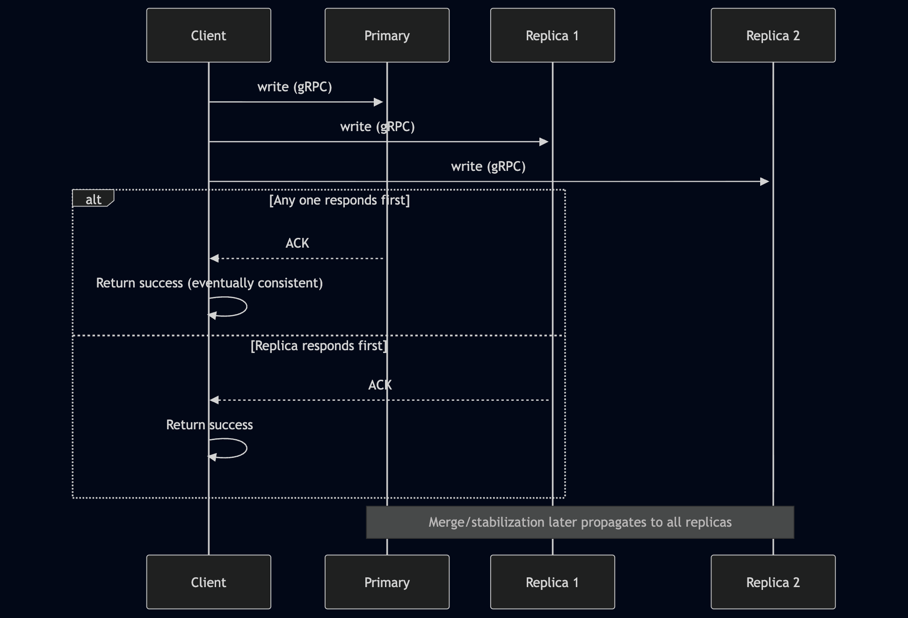
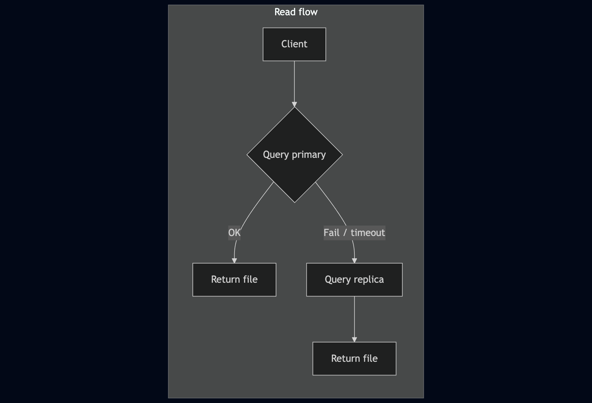
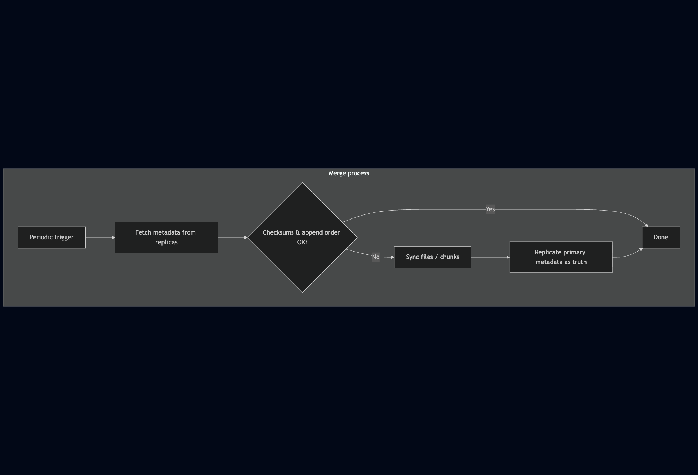
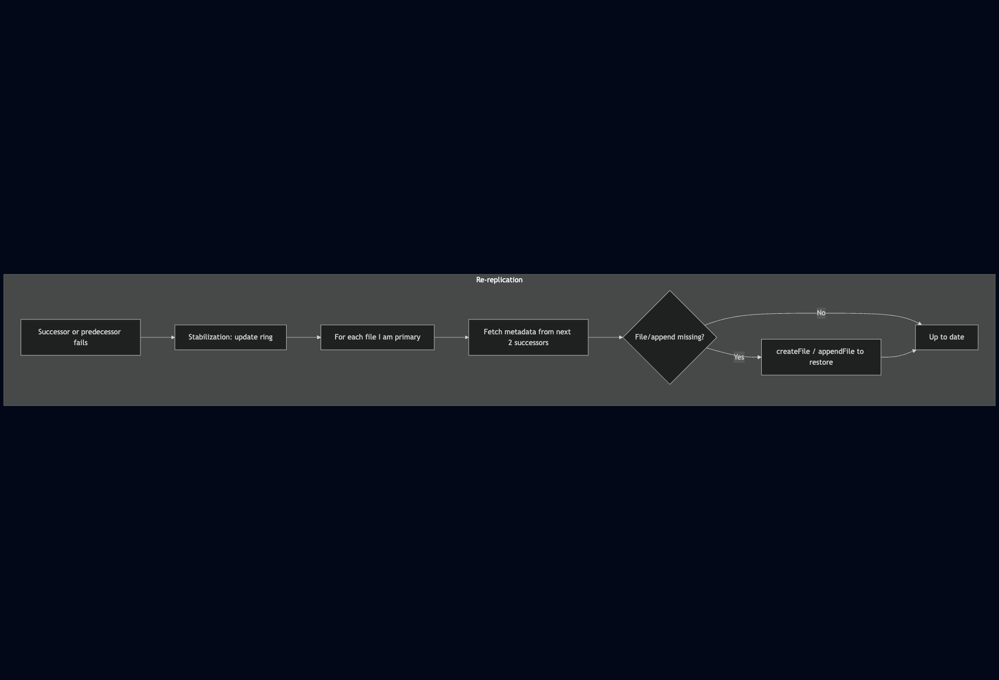
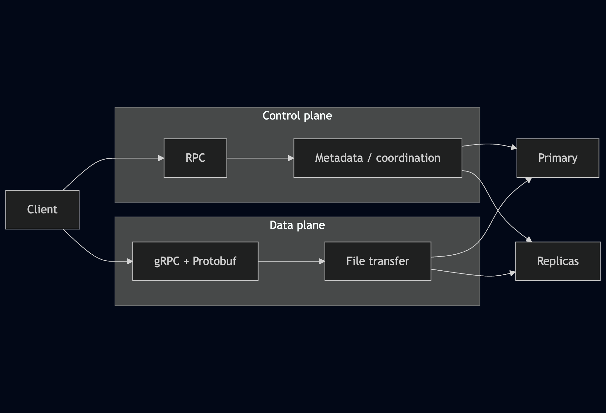

# Distributed System (HyDFS)

This project is a distributed file storage system (HyDFS) built in **Go**, designed for high availability, fault tolerance, and efficient data transfer.

### Design

- **Language & protocols:** The system is implemented in Go. By default it uses the **Gossip Protocol without suspicion** for membership.
- **Control vs data plane:** **RPC** is used for the control plane (coordination and metadata operations), and **gRPC with Protobuf** for data transfer. This keeps coordination lightweight while enabling efficient, high-throughput file transfers over gRPC.

### Replication Level

- Replication level is **3**, tolerating up to **two node failures**. In the worst case, data remains available on at least one replica; the **merge** and **re-replication** mechanisms then copy it to other nodes as needed.

### Consistency Model

- **Writes:** The client sends data in parallel to three servers (one primary and two replicas). A write is considered **successful once any one server acknowledges**. The system is **eventually consistent**: if data is written to at least one server, merge and stabilization protocols ensure it eventually propagates to all replicas.
- **Reads:** The client first queries the **primary**. If the primary does not respond, the system retrieves the file from a **replica**.

### Appends, Ordering, and Merge

- **Appends:** Each append is stored as a **separate file**; append **order is maintained in metadata**. On read, this metadata is used to **concatenate append files in sequence** before returning the result.
- **Ordering:** Each append has a **client timestamp** and a unique **AppendID** (e.g. `filename_timestamp_clientId`). **Per-client append ordering** is enforced using this timestamp.
- **Merge:** A **periodic merge process** verifies consistency using **file checksums** and append metadata. If discrepancies are found, the system synchronizes files and metadata. When metadata append ordering differs, the **primary’s metadata** is used as the source of truth and replicated. Merge runs periodically to keep replicas aligned.

### Re-Replication and Recovery

- **Trigger:** Re-replication is triggered when any of the **next two successors** or the **predecessor** of a node fails.
- **Stabilization:** The stabilization protocol ensures each node **re-replicates files for which it is the primary**, based on the updated ring of active nodes. The node fetches metadata from its **next two successors**; if any file or append is missing, it uses the existing `createFile` and `appendFile` logic to restore them.
- **New nodes:** When a new node joins, some existing nodes may hold **redundant files** outside their replication range. A **background garbage collector** periodically removes such extra data.

## Flow Diagrams

### Write (Create / Append)

Client sends data in parallel to primary and two replicas; success on first acknowledgment.



### Read (Get)

Client tries primary first; on failure, falls back to a replica.



### Merge (Reconciliation)

Periodic merge verifies checksums and metadata, then syncs from primary when needed.



### Re-Replication (Stabilization)

Triggered when a successor or predecessor fails; primary re-replicates its files to restore redundancy.



### High-Level Data Paths



## How to Run

### 1. Prerequisites

- Go 1.25+ installed.

### 2. Start Servers
Run servers in each of the servers. Starts rpc and grpc servers in ports 8080 and 9080 respectively

In each terminal, run:
```
cd mp2
go run . <VM_ID>
```
Example:

```sh
go run . vm1
go run . vm2
go run . vm3
go run . vm4
go run . vm5
go run . vm6
go run . vm7
go run . vm8
go run . vm9
go run . vm10
```

### 3. CLI Commands

- `list_self`: print this node’s membership identifier.
- `list_mem_ids`: show the current membership list with hashes and status.
- `display_protocol`: report the active `{protocol, suspicion}` pair and drop rate.
- `switch {gossip|ping} {suspect|nosuspect}`: change the membership protocol and suspicion mode and broadcast to peers.
- `display_suspects`: list nodes currently marked as suspects.
- `drop <percentage>`: inject simulated message loss (e.g., `drop 0.2` for 20%).
- `leave`: issue a voluntary leave announcement.
- `create <local> <hyDFS>`: upload a local file into HyDFS.
- `get <hyDFS> <local>`: download a HyDFS file into the local directory.
- `append <local> <hyDFS>`: append data from a local file to a HyDFS file.
- `merge <hyDFS>`: trigger metadata/file reconciliation for the named file.
- `multiappend <hyDFS> <vm...> <local...>`: orchestrate parallel appends from multiple VMs.
- `printmeta <hyDFS>`: display stored metadata (including append order) for a file.
- `ls <hyDFS>`: list replicas that currently store the file.
- `liststore`: enumerate all files stored on this VM along with their IDs.
- `getfromreplica <vm> <hyDFS> <local>`: fetch a replica directly from a specific VM.