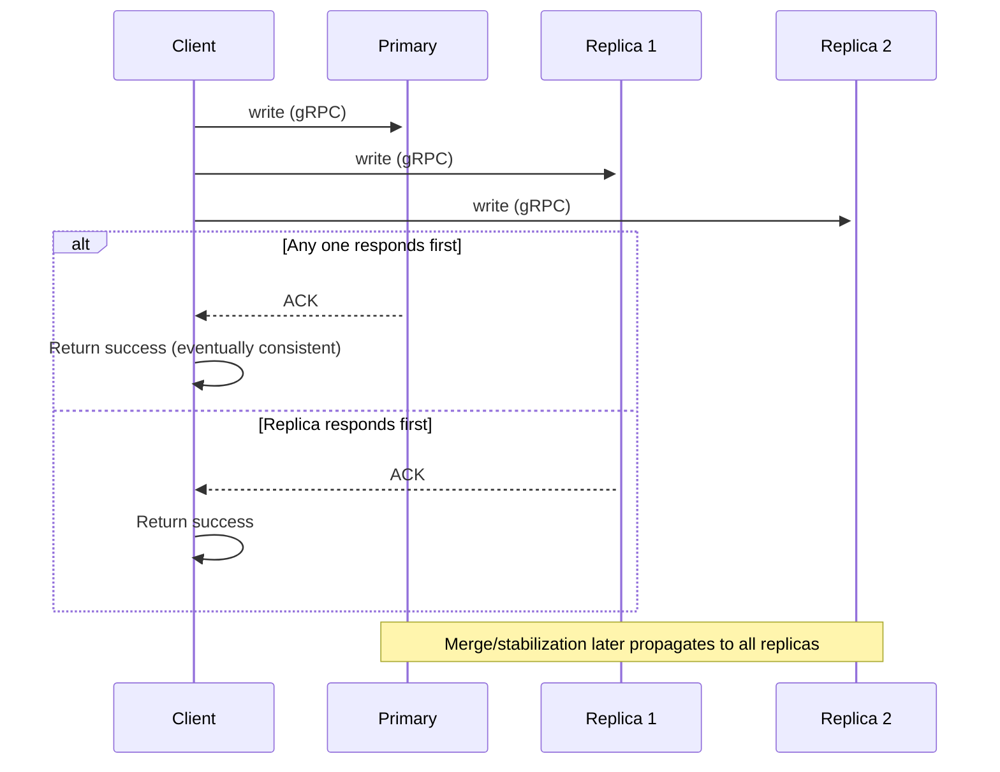
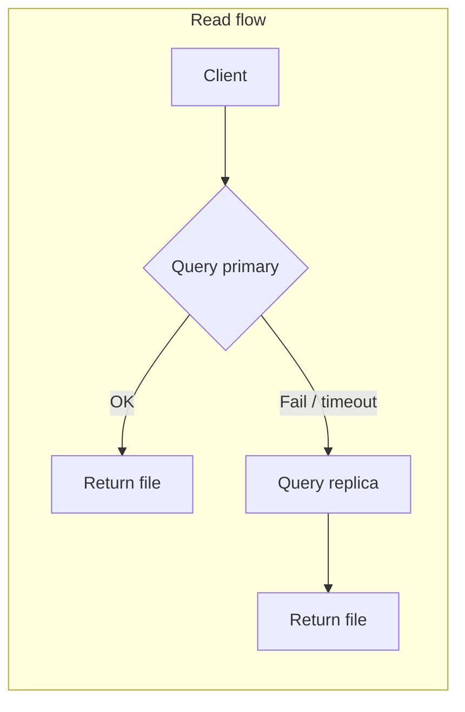
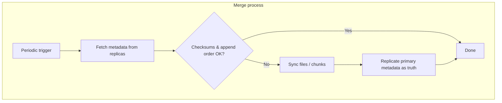
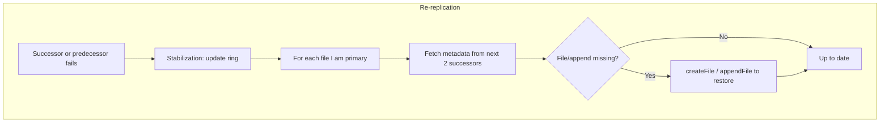
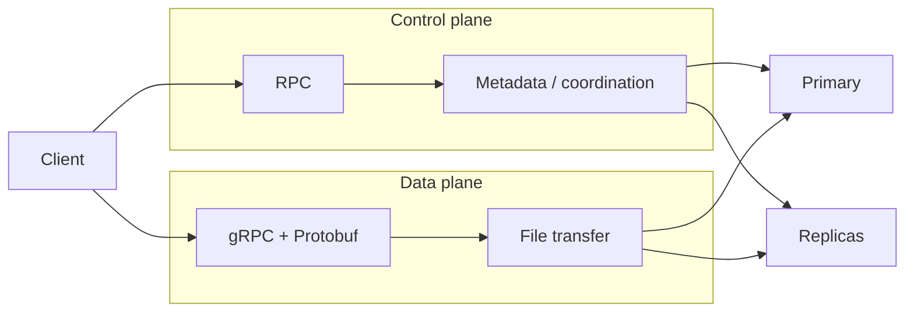

## Flow Diagrams

### Write (Create / Append)

Client sends data in parallel to primary and two replicas; success on first acknowledgment.

### Read (Get)

Client tries primary first; on failure, falls back to a replica.

### Merge (Reconciliation)

Periodic merge verifies checksums and metadata, then syncs from primary when needed.

### Re-Replication (Stabilization)

Triggered when a successor or predecessor fails; primary re-replicates its files to restore redundancy.

### High-Level Data Paths

